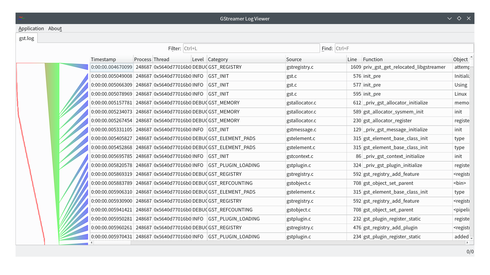

# GStreamer Log Viewer

## Overview
GStreamer Log Viewer is a tool designed to efficiently handle the voluminous debug logs produced during GStreamer debugging sessions. It aids in navigating, categorizing, and analyzing the debug information, making the debugging process smoother and quicker. GStreamer's debugging system generates detailed logs that can be overwhelming; this viewer makes it easier to manage and understand these logs.

## GStreamer debug log

To get a debug log file, set environment variables as below:
- export GST_DEBUG_FILE=gst.log
- export GST_DEBUG_NO_COLOR=1
- export GST_DEBUG=5

See [Running GStreamer Applications](https://gstreamer.freedesktop.org/documentation/gstreamer/running.html?gi-language=c) for details.

## Features
- **Open Log Files**: Easily accessible through the Application menu to open and view logs.
- **Visual Timeline**: Logs are displayed in a table format with a visual timeline on the left, enhancing the ease of understanding log sequences.
- **Filtering Options**: Filters can be applied directly in the toolbar, allowing for column-specific filtering using the format `column_name:search_keyword`.
- **Search Functionality**: Users can search through the logs using the search bar by entering text and pressing enter to filter the logs.
- **External Editor Integration**: Double-click on the 'Timestamp' column data to open it in an externally configured text editor.
- **Source Code Navigation**: Double-click on the 'Line' column data to jump to the corresponding line in the source code.

## Installation
To install GStreamer Log Viewer, follow these steps:
1. Clone the repository from GitHub at https://github.com/task-jp/gstreamer-log-viewer.
2. Ensure that Qt 6 is installed as it is a dependency for running the application.
3. Follow the provided setup instructions to compile and run the viewer.

## Usage
After installation, you can start the application via the executable created in the build process. Use the Application menu to open log files and start viewing and filtering GStreamer debug logs. For detailed instructions, refer to the features section above.

## Configuration and Customization
Settings for the application can be accessed via `Application > Preferences...` Here, users can configure:
- **External Text Editor**: Set the path to the external editor for opening log files directly.
- **GStreamer Source Code Path**: Set the local path to the GStreamer source code for integrated source navigation.

## Contributing
Contributions are welcome! Please refer to the GitHub repository to report issues, suggest features, or submit pull requests. Follow the standard GitHub flow for collaborating on projects.

## License
GStreamer Log Viewer is licensed under the GNU General Public License v2 (GPLv2), which allows for free usage and distribution under certain conditions. For more details, refer to the LICENSE file in the repository.

## Contact
For further assistance or to contribute to the project, please visit the project's GitHub page at https://github.com/task-jp/gstreamer-log-viewer.
